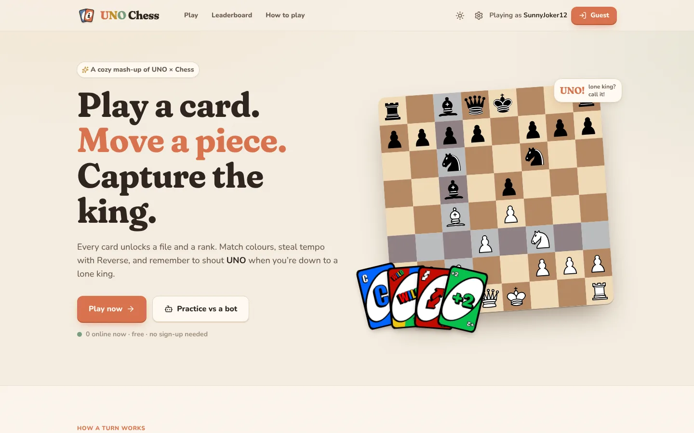
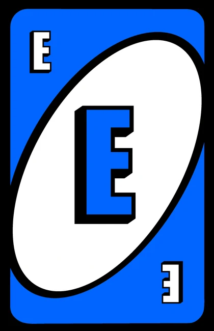
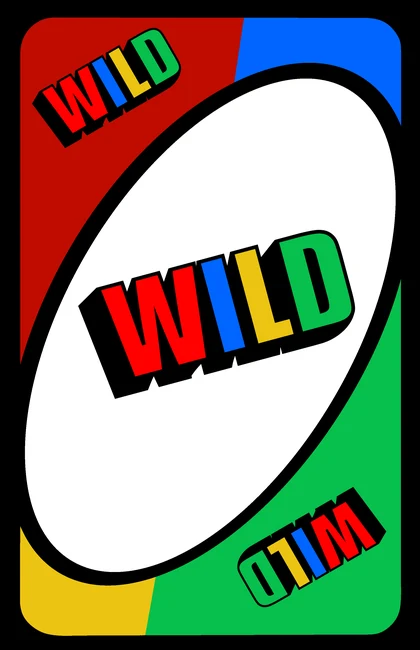
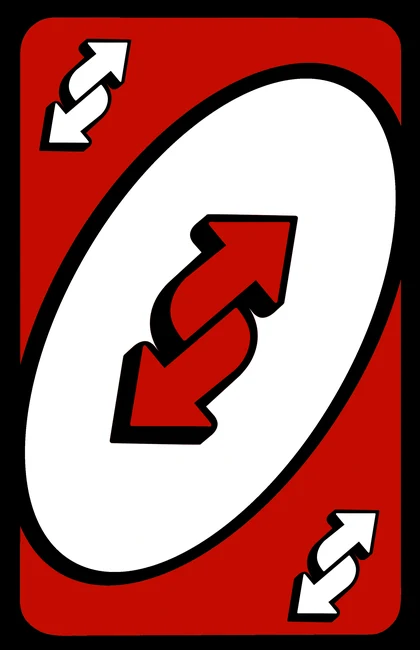
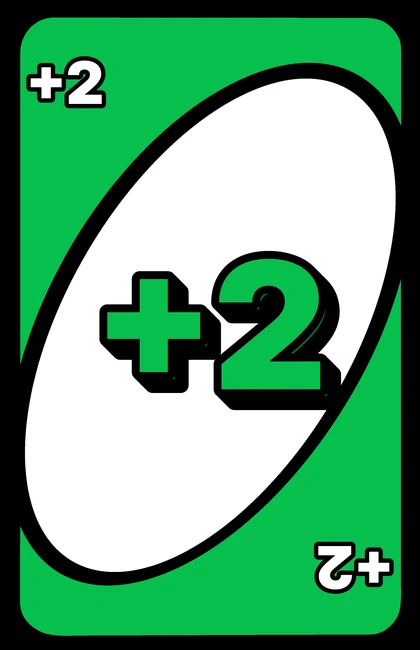
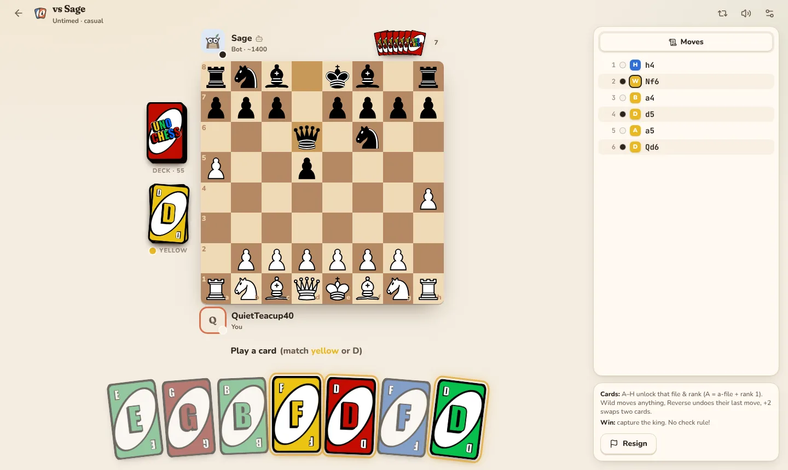
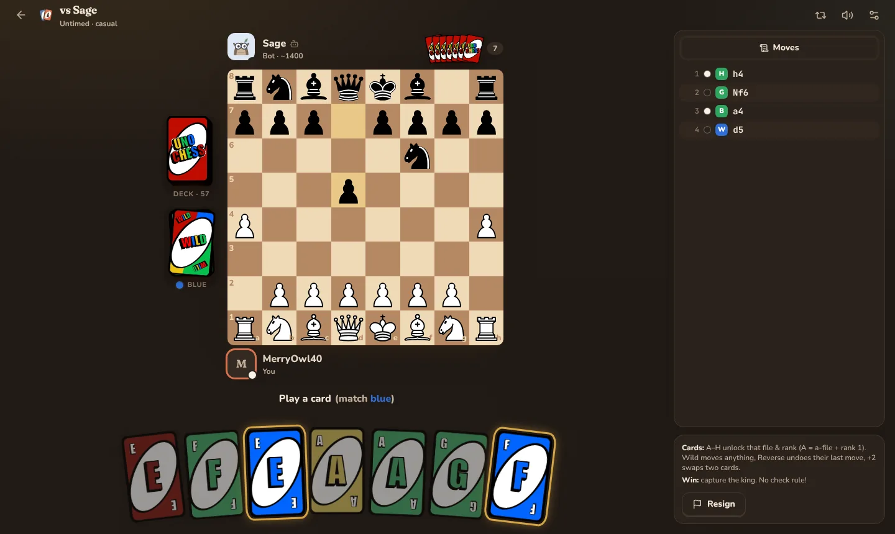
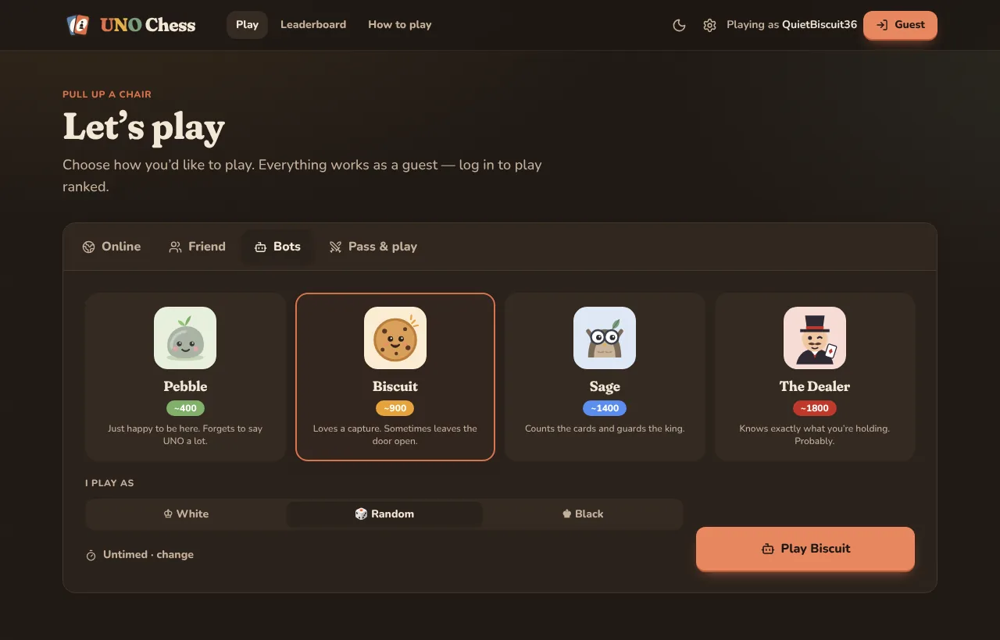
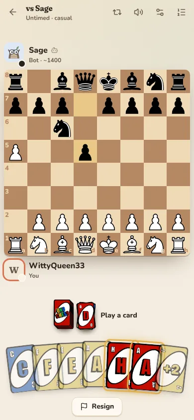
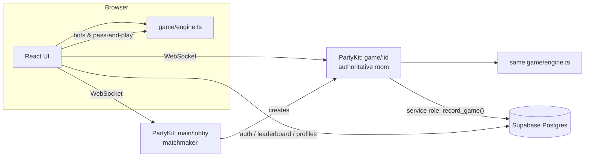

<div align="center">


# UNO Chess

**Play a card. Move a piece. Capture the king.**

A cozy, fully-featured web game that mashes up UNO and chess — play bots, invite a friend with a link,
jump into casual matchmaking, or climb the ranked ladder with chess.com-style Glicko-2 ratings.



</div>

---

## Contents

- [Features](#features)
- [How to play](#how-to-play)
- [Screenshots](#screenshots)
- [Tech stack](#tech-stack)
- [Getting started](#getting-started)
- [Project structure](#project-structure)
- [Architecture](#architecture)
- [Accounts, ratings & Supabase](#accounts-ratings--supabase)
- [Deployment](#deployment)
- [Testing](#testing)
- [Credits](#credits)

## Features

**Game**
- Complete rules engine for the [TripleSGames](https://www.youtube.com/@TripleSGames) UNO Chess variant — matching, rank/file unlocks, Wild, Reverse undo, Draw Two swaps, card-referenced castling & en passant, king capture with the Reverse veto, the lone-king **UNO!** call (and catching opponents who forget), and the six-card no-move draw.
- A game screen that **always fits your screen** — board, both players, piles and your whole hand are visible without scrolling on laptops and phones.
- Hover a card to preview the file & rank it unlocks; legal-move dots; drag or click to move; promotion picker; keyboard shortcuts (`1–9` play cards, `U` UNO, `F` flip).
- Sounds, confetti, smooth card & piece animations, light/dark themes and five board colours.
- **Avatars** from the [DiceBear](https://www.dicebear.com) *Adventurer* API: everyone gets a random one automatically, can pick from a grid, shuffle endlessly, or hit *Randomize* any time. Only DiceBear URLs are accepted (validated in the browser, on the game server and by a database constraint).
- **Leaderboard** comes pre-populated with easy-to-beat sample players (all below the 1200 starting rating) — seeded into Supabase by a migration, and built into the site as a fallback.

**Modes**
| Mode | Account | Notes |
|---|---|---|
| 🤖 **Bots** | not needed | Four card-counting bots (Pebble ~400 → The Dealer ~1800). They only use information a human could see. |
| 🫱 **Pass & play** | not needed | One device; hands are hidden while you pass it over. |
| 🔗 **Friends** | not needed | Share a link, choose colour & clock. Spectators welcome. Optional rated games when both players are logged in. |
| 🌍 **Casual** | not needed | Matchmaking against anyone, per time control. |
| 👑 **Ranked** | required | Glicko-2 ratings per category (bullet / blitz / rapid), widening rating windows, leaderboard & rating history. |

**Online play**
- Server-authoritative games on [PartyKit](https://partykit.io) — every move is validated server-side and players **never receive the deck or the opponent's hand**.
- Server clocks with increments, a 30-second first-move rule (abort), abandonment after 60 s disconnected, draw offers, rematches with colour swap, quick chat, reconnection.
- Guest mode by default; log in with email/password, magic link, Google, GitHub or Discord (Supabase) to play ranked.

## How to play

1. **Setup** — normal chess position; each player gets **7 cards** from a 76-card deck: two of each **A–H** (= 1–8) in four colours, one **Reverse** and one **Draw Two** per colour, and four **Wilds**. One card is flipped to start the pile (its action is ignored). White starts.
2. **Play a card** — you must play a card that matches the pile by **colour, letter or symbol** (Wilds match anything).
3. **Move a piece** — a letter unlocks its **file and rank** (A = a-file + rank 1 … H = h-file + rank 8). Move any of your pieces that *starts* on those lines. A Wild lets you move anything (and pick the next colour).
4. **Draw** one replacement card. Your turn ends.

| Card | Effect |
|---|---|
|  **A–H** | Move a piece on that file or rank |
|  **Wild** | Move any piece, choose the colour to match |
|  **Reverse** | Instead of moving, undo the opponent's last move (captures come back) |
|  **Draw Two** | Instead of moving, swap two cards from your hand for fresh ones |

- **No check.** Kings may walk into danger and nothing is pinned. **Capture the king to win** — unless the victim plays a *matching Reverse* to veto it.
- **Castling** needs a card that references the king (allowed out of, through or into check). **En passant** needs a card that references the capturing pawn.
- **Stuck?** If no card can be played (or none of them can move a piece), discard any card.
- **UNO!** Down to a lone king? Call UNO before your turn ends — if your opponent catches you, you lose.
- **Draw** after six cards in a row with no piece moving, or by agreement.

The full illustrated rules live at `/rules` in the app.

## Screenshots

| Desktop (light) | Desktop (dark) |
|---|---|
|  |  |

| Choose a bot | Phone |
|---|---|
|  |  |

## Tech stack

| Area | Libraries |
|---|---|
| App | [React 19](https://react.dev), [Vite](https://vite.dev), TypeScript, [React Router](https://reactrouter.com) |
| UI | [Tailwind CSS v4](https://tailwindcss.com), [Radix UI](https://www.radix-ui.com) (dialog, tooltip, tabs, switch, dropdown), [Motion](https://motion.dev), [lucide](https://lucide.dev) icons, [sonner](https://sonner.emilkowal.ski) toasts, [canvas-confetti](https://github.com/catdad/canvas-confetti) |
| Board | [react-chessboard](https://github.com/Clariity/react-chessboard) with a custom UNO Chess move generator |
| State & data | [Zustand](https://zustand.docs.pmnd.rs) (persisted), [TanStack Query](https://tanstack.com/query), [Recharts](https://recharts.org) |
| Sound | [Howler.js](https://howlerjs.com) |
| Realtime | [PartyKit](https://partykit.io) + [partysocket](https://www.npmjs.com/package/partysocket), [zod](https://zod.dev) message validation |
| Accounts & DB | [Supabase](https://supabase.com) (Auth + Postgres + RLS), [jose](https://github.com/panva/jose) JWT verification |
| Public APIs | [DiceBear](https://www.dicebear.com) avatars, Google Fonts (Fraunces, Nunito, JetBrains Mono) |
| Testing | [Vitest](https://vitest.dev), [Playwright](https://playwright.dev) |

## Getting started

```bash
npm install
npm run dev        # Vite on :5173 + PartyKit on :1999 (proxied at /parties)
```

Open http://localhost:5173. Everything works out of the box as a guest — bots, pass & play, friend links and
casual matchmaking. Accounts/ranked switch on once Supabase is configured (below).

Useful scripts:

| Script | What it does |
|---|---|
| `npm run dev` | Web app + game server |
| `npm run build` | Type-check and production build |
| `npm test` | Unit tests (engine, bots, ratings, game rooms, matchmaker) |
| `npm run test:online` | Integration tests against a running `partykit dev` |
| `npm run test:e2e` | Playwright browser tests (starts both servers) |
| `npm run party:deploy` | Deploy the game server to PartyKit |

Copy `.env.example` to `.env` and fill in what you need — every variable is optional for local development.

## Project structure

```
src/
  game/             Pure, framework-free game logic (shared by browser and server)
    engine.ts       Turn state machine: play, move, draw two, reverse, veto, UNO, results
    board.ts        Move generation, castling/en passant, SAN notation, FEN helpers
    cards.ts        Deck, matching, file/rank unlocks
    rating.ts       Glicko-2 + time controls
    ai/             Bot evaluation and card-counting decision making
    ui/             Game screen components (board, hand, piles, clocks, dialogs)
  pages/            Home, Play, Bot/Local/Online game, Rules, Leaderboard, Profile, Login, Settings
  stores/           Zustand stores: auth (Supabase + guests), settings, local games
  net/              Wire protocol (zod), PartySocket hooks for the lobby and game rooms
party/
  main.ts           Lobby & matchmaker (casual / ranked queues per time control)
  game.ts           One room per game: sockets, persistence, alarms, rating updates
  gameRoom.ts       Pure room logic (seats, clocks, draws, rematch) — unit tested
supabase/migrations Database schema, RLS policies and record_game()
e2e/                Playwright tests
```

## Architecture



- The **same engine** runs in the browser (bots, pass & play, move hints) and on the server (online games). It's pure and deterministic (seeded RNG), which makes it easy to test.
- The server sends each connection a **redacted view**: opponents' cards and the deck order are replaced by face-down placeholders and the RNG state is stripped.
- When a rated game ends, the server reads both ratings, computes Glicko-2 and writes the game, ratings and history through one transactional SQL function that only the service role may call.

## Accounts, ratings & Supabase

1. Create a Supabase project and run the migrations in `supabase/migrations/` in order (SQL editor, or `npx supabase link && npm run db:push`). The last one seeds the sample leaderboard players; remove them any time with `delete from auth.users where email like '%@seed.unochess.invalid';`.
2. Frontend env (Vercel / `.env`): `VITE_SUPABASE_URL`, `VITE_SUPABASE_ANON_KEY`.
3. Game-server env (PartyKit): `SUPABASE_URL`, `SUPABASE_SERVICE_ROLE_KEY` (and `SUPABASE_JWT_SECRET` only for legacy HS256 projects).
4. In Supabase → Authentication → URL configuration, add your site URL to the redirect list. Enable the Google / GitHub / Discord providers if you want social login.

Without these variables the site runs in **guest mode**: everything except ranked play, profiles and leaderboards.

Ratings use **Glicko-2** (like chess.com and Lichess): everyone starts at 1200 with a high rating deviation, shown as provisional (`1200?`) until it settles. Bullet (< 3 min), blitz (3–9 min) and rapid (≥ 10 min) are rated separately.

## Deployment

| Piece | Host | Command |
|---|---|---|
| Website | [Vercel](https://vercel.com) (static Vite build, SPA rewrites in `vercel.json`) | push to GitHub / `vercel deploy` |
| Game server | [PartyKit](https://partykit.io) (Cloudflare) | `npx partykit login && npm run party:deploy` |

After deploying PartyKit, set `VITE_PARTYKIT_HOST` on Vercel to the host it prints (e.g. `unochess.<you>.partykit.dev`, no protocol) and redeploy.
Set the server secrets with `npx partykit env add <NAME>`: `PARTY_SECRET` (any long random string), `ALLOWED_ORIGINS`
(your site URL), plus the Supabase values above.

## Testing

- **Unit tests** (`npm test`) — 90+ tests: every rule and edge case (castling through check, en passant expiry, promotion, Reverse restoring captures and castling rights, veto, UNO call/catch, deck reshuffle, six-card draw, hidden views), a **fuzzer** that plays 400 random games checking invariants (card conservation, unique ids, always-a-legal-action), bots at every level, Glicko-2 against Glickman's published example, game-room clocks/abort/abandon/draw/rematch, and matchmaking.
- **Integration** (`npm run test:online`) — real WebSocket clients against `partykit dev`: matchmaking, a full game driven by bots, spectators, cheat attempts and validation.
- **End-to-end** (`npm run test:e2e`) — Playwright: bot games, refresh/resume, resignation, two browsers playing a friend game (spectator, draw offer, rematch), casual matchmaking, UNO call/catch, Reverse veto, Draw Two, and a check that the game screen never scrolls on desktop or mobile.
- The SQL migration was verified against PostgreSQL 16 (re-runnable, unique usernames, idempotent `record_game`, permissions).

## Art assets

Sidebar icons come from Microsoft's MIT-licensed Fluent Emoji set. Optional higher-quality art (bot portraits, logo, a custom piece set) can be dropped into `public/` and is picked up automatically — see [docs/ASSET_PROMPTS.md](docs/ASSET_PROMPTS.md) for exact files, sizes and ready-to-use image-generation prompts.

## Credits

- Game design: **UNO Chess** by [TripleSGames](https://www.youtube.com/@TripleSGames). This is a fan project and is not affiliated with Mattel or UNO®.
- Chess sound effects from the original project; card and UNO sounds synthesized for this project.
- Player avatars by the [DiceBear](https://www.dicebear.com) API (various styles and licences — see their site); bot characters drawn for this project.
